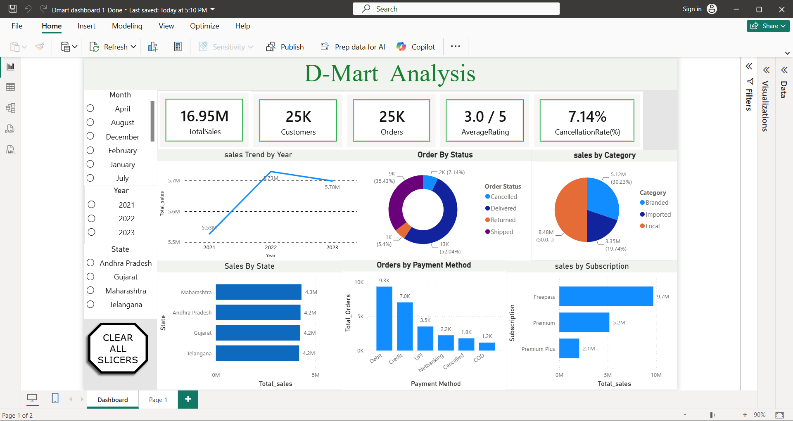

# 📊 DMart Sales Analysis BI Dashboard

This repository contains a **Business Intelligence (BI) dashboard** project focused on analyzing **DMart’s sales performance**. It provides interactive visualizations and insights into sales trends, product performance, and customer behavior to support data-driven decision-making.

---

## 🚀 Features
- Interactive dashboards for **sales, revenue, and profit analysis**
- Drill-down by **region, store, category, and product**
- KPIs highlighting **top-performing products** and **low-performing segments**
- Time-series analysis to track **seasonal trends and growth patterns**
- Clean, intuitive design for **decision-making and reporting**

---

## 🛠️ Tech Stack
- **Power BI** (or Tableau/Excel, depending on your implementation)
- **SQL / Python** for data preprocessing
- **CSV/Excel datasets** for raw sales data

---

## 🎯 Purpose
The goal of this project is to provide a **data-driven view of D mart’s business performance**, enabling stakeholders to:
- Identify growth opportunities
- Optimize inventory and supply chain
- Improve customer targeting and marketing strategies

---

## 📷 Dashboard Screenshot

